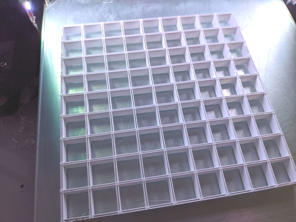

# PCB Spacer

This JS/HTML Script generates gcode for a simple grid pattern that spaces the PCB with the LEDs and the front PCB and protects from light bleeding through to the next LED. It should be printed with fairly opaque but reflective material. If you use black/dark plastic, consider painting it white. If you use white, use one that's actually opaque. Most white are too translucent. I can recommend [kexcelled K5-shade: light shielding PETG](https://kexcelled.nl/product/petgk5-shade) e.g. from [ruhr3d](https://ruhr3d.shop/products/petg-spezial-lichtdicht-1-75mm-natur-1-0kg).

⚠ Don't use the gcode unless you know what u are doing. The gcode is tuned for my printer, it may damage yours.

