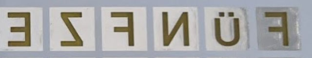

# WordClock Project (WIP)

WordClock (german) based on SK6812 RGB LEDs, custom PCB and 3D printed parts.

# PCB Design

## Mask
The front mask with the letters is a 0.6 mm thin and 150x150 mm wide PCB. Copper and Soldermask mask the light, while the exposed FR4 diffuses the light from the LEDs. 0.6 mm PCBs with white solder mask are pretty expensive though. 1 mm may also work just fine. You may also choose a different color for the front mask!

The soldermask on the bottom layer is removed to expose the HASL finish. This acts as reflector for the light and protects from color disturbance if you choose a colored solder mask.

All masks are generated using OpenSCAD.

## LED Backplate

The backplate houses 9x9 SK6812 RGB LEDs (don't use RGBW LEDs or blue will be pretty washed out. The white phosphor is glowing due to the reflections back onto the LED).
Soldermask is removed around the LEDs to expose the HASL finish as reflector.

The PCB just exposes DIN, DOUT and power. So it is just a display unit. A microcontroller will have to sit on another board.

# Assembly
PCBs and Spacer are glued together using Acrylic/Silicone from the hardware store. I used a 10 ml syringe to apply it. Other opaque glue may also work - I was worried regular transparent glue may let light through.
Apply lines of glue in one direction on the pcb and in the other direction on the spacer. Then push them together. There are 3D printed jigs available to help with alignment.
Glue the spacer to the front mask pcb first and let it set. Hold the pcb against the light to see if some glue may have obscured some letters and remove it if necessary.
If you use the assemply jig, don't forget to remove the inner alignment jig before the next step ;)
Now glue the back pcb to the spacer.
Keep in mind that trapped air needs to escape from each void when you press the PCBs together. The back PCB has ventilation vias for that.
When glued together the PCBs should be flush with the jig.
**Let the glue set for severl days**. It will set pretty slow as there is only small ventilation through the vias.

**Do not apply power to the LEDs until the glue is set for several days!** Moist glue may corrode the exposed tracks on the PCB when power is applied!

